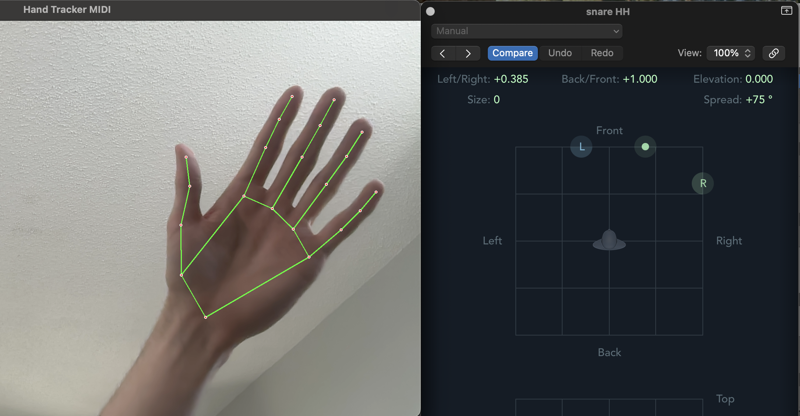

# Hand Tracker MIDI Controller

This project uses a webcam to track hand movement with MediaPipe and sends MIDI CC messages with `mido`.

## Design Goals

- Use webcam-based hand tracking as a non-contact control interface  
- Translate 3D hand motion into stable MIDI CC signals  
- Reduce jitter enough for musically usable control  
- Explore intuitive mappings between gesture and sound  

## How it Works
Webcam → MediaPipe hand landmarks → wrist XYZ extraction → smoothing → MIDI CC output → DAW control

Tracks up to two hands
Uses wrist position (X, Y, Z) as control signals
Applies moving-average smoothing to reduce jitter
Maps each hand to three MIDI CC channels

## Key Findings

Raw hand tracking data is too unstable for expressive control without smoothing

- A short moving-average window improves usability while keeping latency manageable
Mapping wrist position directly to MIDI CC values provides a workable real-time control system
- The MediaPipe Tasks API requires local model loading and careful environment setup
- In downstream audio testing, stereo signals routed through a 3D object panner showed a perceived dip near the center position, while mono sources produced more consistent spatial behavior

## Future Work

- Add configurable smoothing parameters
- Explore gesture-based triggers in addition to continuous control
- Compare wrist tracking vs fingertip or palm-center tracking
- Improve calibration across different users and camera setups

## Status

Prototype / exploratory project focused on real-time interaction design.

## Requirements

- macOS
- Python 3.11
- Webcam access enabled
- An available MIDI output port

## Setup

Create a virtual environment:

```bash
python3.11 -m venv .venv
```

Activate it:

```bash
source .venv/bin/activate
```

Install dependencies:

```bash
pip install -r requirements.txt
```

Add the MediaPipe hand landmarker model file:

- Put `hand_landmarker.task` in `models/`
- The expected path is `models/hand_landmarker.task`

## Run

Start the script with:

```bash
python hand_tracker.py
```

Press `q` to quit the webcam window.

## Notes

- In your editor, use `.venv/bin/python` as the interpreter.
- If the MIDI port name does not match your system, update `MIDI_PORT_NAME` in `hand_tracker.py`.
- This script depends on `opencv-python`, `mediapipe`, `mido`, and `python-rtmidi`.
- The script uses the MediaPipe Tasks API, not `mp.solutions`.

